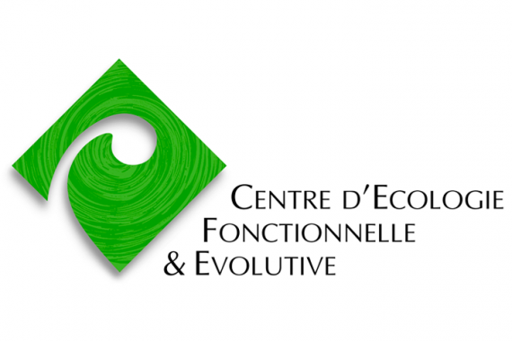
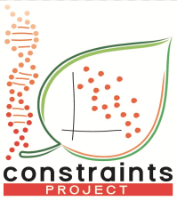

# About CropTrait

  The CropTrait Database, defined as a multiple-crops database, focuses on ecophysiological traits related to resource use and acquisition of cultivated plants. The main goal of the database is to analyse if the functional profile (phenotypic space) of domesticated species is similar to that of wild plants.

### Cite the application
 "CropTrait, A. Vaillant, CEFE-CNRS, 2023"

### Contact
  PI of the project : Cyrille Violle - cyrille.violle@cefe.cnrs.fr
  CropTrait designer : Axel Vaillant - axel.vaillant@cefe.cnrs.fr

         

