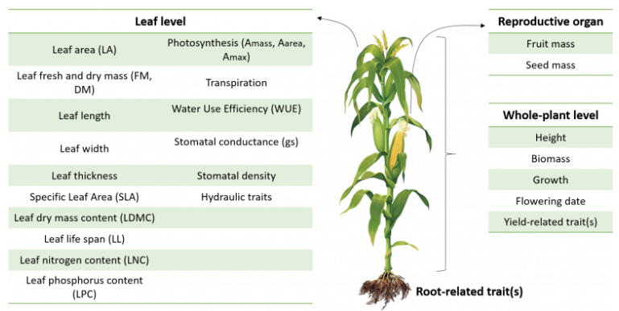
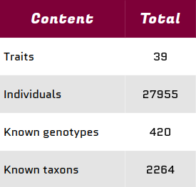
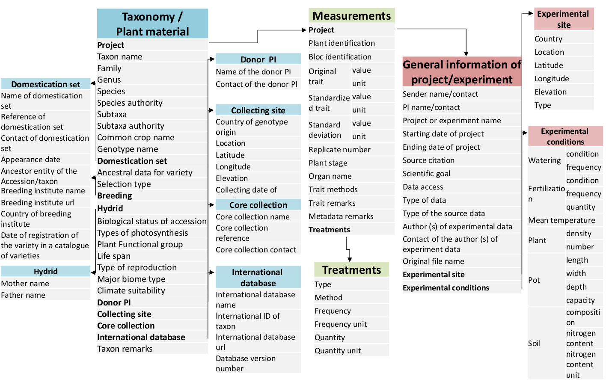

# Welcome to CropTrait

 The CropTrait Database, defined as a multiple-crops database, focuses on ecophysiological traits related to resource use and acquisition of cultivated plants 

 

  
 The CropTrait Database is composed of multi-sources with heterogeneous data including compilated data from litterature or other databases, data from our experiments and from our collaborators. The data are currently private and only available to our collaborators.

**The database is configured for a minimal set of traits and is flexible enough to enter more traits, species, genotypes and ancillary data.** The database allows collecting data at different levels from general information about plant material description, including taxonomy and origin of material, to environnemental conditions and methods of measurements. 

 

